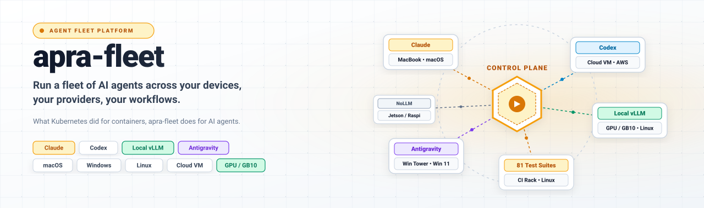
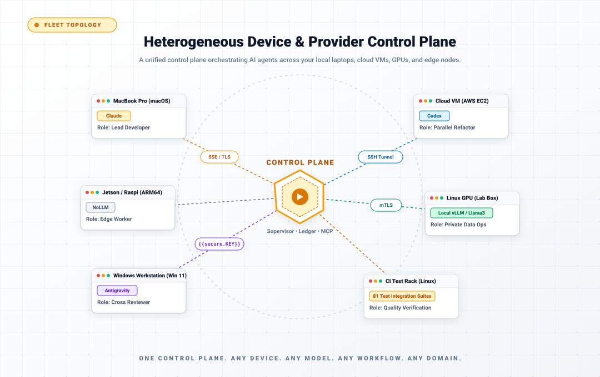
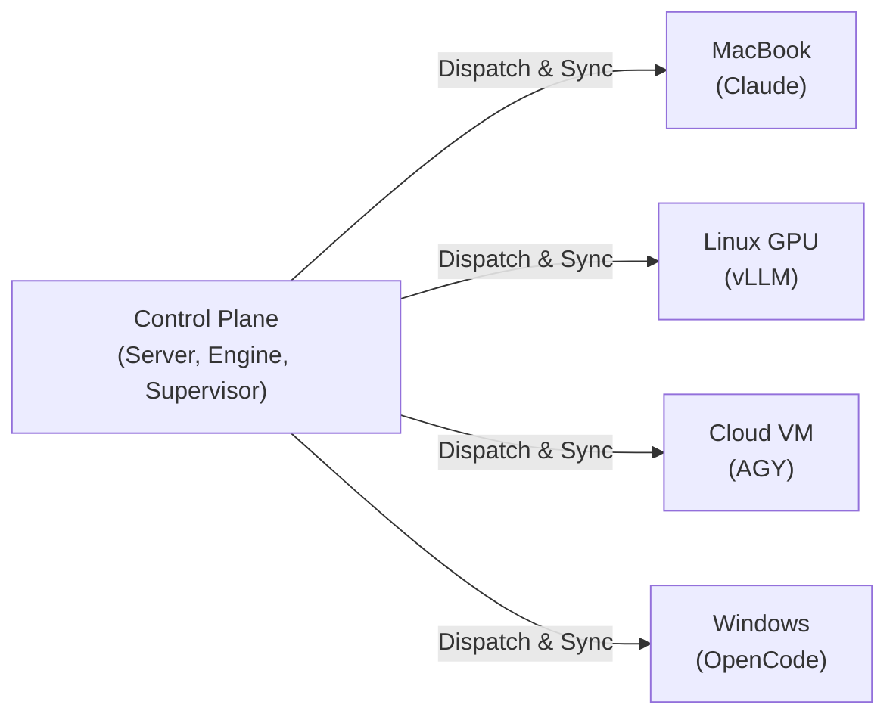

<div align="center">

<picture>
  <source media="(prefers-color-scheme: dark)" srcset="assets/marketing/hero-banner-dark.svg">
  
</picture>

# apra-fleet

**Run a fleet of AI agents across your devices, your providers, your workflows.**

What Kubernetes did for containers, apra-fleet does for AI agents:
scheduling, credentials, isolation, and observability for an agentic
workforce -- on any machine, anywhere, using every LLM provider at once.

[](https://github.com/Apra-Labs/apra-fleet/actions/workflows/ci.yml)
[](https://opensource.org/licenses/Apache-2.0)
[](https://github.com/Apra-Labs/apra-fleet/releases)
[](https://modelcontextprotocol.io)
[](https://deepwiki.com/Apra-Labs/apra-fleet)

[Quick Start](#quick-start-5-minutes) - [Live Demo](#watch-a-fleet-work) - [How It Works](#how-it-works) - [fleet-sprint Getting Started Guide](docs/fleet-sprint-getting-started.md) - [Website](https://apra-labs.github.io/apra-fleet)

</div>

---


> **This repository is built by the product you are looking at.** An
> autonomous apra-fleet workflow plans, codes, reviews, tests, and ships
> this codebase in multi-hour sprints -- filing bugs against itself and
> fixing them. The recording above is a real run, not a mockup.

---

## Why a fleet?

Running one AI agent is a demo. Running fifty -- across a MacBook in the
office, a GPU box in the lab, three cloud VMs, and your CI -- is an
operations problem nobody else has solved:

- **Which machine runs which agent?** Real devices, not throwaway sandboxes:
  registered, credentialed, health-checked members you already own.
- **Which model does which job?** Claude for review, a cheap tier for
  mechanical edits, a local vLLM model for private data -- all in one fleet,
  routed by cost tier, switchable per task.
- **Who watches the agents?** Durable workflows with supervisors, watchdogs,
  reservations, and live dashboards. Agents that die get detected. Work that
  stalls gets resumed. Nothing runs silently.
- **Who holds the keys?** Secrets entered out-of-band, never visible to any
  model. Per-provider permission composition. Network egress policy per
  credential.

One control plane. Any device. Any model. Any workflow. Any domain.

## What you get

| Pillar | Concretely |
|---|---|
| **Any device** | Register any Windows / macOS / Linux machine (local or over SSH) as a fleet member in one command. Cloud members auto-start on demand. Windows members are fully supported for dispatch, command execution, and background long-running tasks (launched detached via WMI). |
| **Any model** | Claude, Codex, Copilot, Antigravity, local models (any OpenAI-compatible endpoint via OpenCode) -- mixed freely. Tier-based routing (cheap / standard / premium) keeps cost governance built in. Cross-provider review is a quality mechanism: a different model, with different blind spots, checks every change. |
| **Any workflow** | Workflows are durable programs, not prompt chains: multi-hour, resumable, observable, with member reservations and atomic state. Write your own; ship it to the fleet. |
| **Any domain** | Not just software development. The pattern fits wherever work decomposes into agent-sized pieces that need orchestration and an audit trail: nightly retail replenishment (reconcile inventory deltas, draft purchase orders for sign-off), logistics exception handling (triage a delayed shipment, re-book, notify), healthcare intake (summarize referrals, check completeness, route), back-office runs (invoice matching, compliance evidence collection). Software engineering is the vertical running today -- your domain is a workflow away. |

<picture>
  <source media="(prefers-color-scheme: dark)" srcset="assets/marketing/fleet-topology-dark.svg">
  
</picture>

## Watch a fleet work

Our flagship workflow, **fleet-sprint**, develops software autonomously:
plan -> develop -> review -> deploy -> integration-test -> harvest, in
cycles, until the goal is met or the evidence says stop.

It is not a toy. It builds apra-fleet itself:

- Multi-cycle sprints running for hours, unattended
- 2,300+ unit tests and an 81-file integration suite against real backends
- Files bugs against itself, decomposes them, fixes them, and blocks its
  own release until quality gates pass
- Every dispatch, verdict, and dollar visible live on the dashboard
- Every sprint's raw child stdout/stderr is captured to a per-sprint log
  and linked from the dashboard, so a run's output is traceable even if it
  crashes before reporting anything back

A fleet that has run in production:

```
pm-1      Opus (premium)      orchestrator
doer-1    Sonnet (standard)   feature work
doer-2    Antigravity         large-context tasks
reviewer  Opus (premium)      final review
```

The engine does not know what a "sprint" is; it knows how to run your
workflow reliably across your fleet (see **Any domain** above).

## Quick start (5 minutes)

**1. Install** -- one command via npm (Node.js 22+), or grab the
standalone installer binary for your platform from
[Releases](https://github.com/Apra-Labs/apra-fleet/releases) and
double-click it (installation is the default action):

```bash
npm install -g @apralabs/apra-fleet
apra-fleet                   # installs for Claude Code (default)
apra-fleet --llm agy         # or OpenCode/Codex/Copilot
cd ~/.apra-fleet/bin && apra-fleet start             # start the apra-fleet
```

**2. Connect your agent.** Load the fleet server in Claude Code with
`/mcp` (or restart your provider CLI). Your agent now has a fleet.

**3. Register members -- in plain language.** apra-fleet is driven
conversationally through any MCP-capable agent:

> "Register a local member called `doer`. Register another called
> `reviewer`. Pair them."

> "Register 192.168.1.10 as `build-server`. Username akhil, work folder
> `/home/akhil/projects/myapp`."

Remote passwords are collected out-of-band -- typed into a separate
terminal, never the chat -- used once to set up SSH keys, then forgotten.

**4. Run your first workflow:**

```bash
apra-fleet workflow hello-world
```

Then point the fleet at real work:

```bash
apra-fleet workflow fleet-sprint \
  --issue my-project-epic --members doer \
  --branch fleet-sprint/first-run --base main
```

Open the dashboard, watch your fleet PLAN->BUILD->REVIEW->TEST->SHIP in a loop till closure

> **New to fleet-sprint?** Read the
> [fleet-sprint Getting Started Guide](https://apra-labs.github.io/apra-fleet/fleet-sprint-getting-started.html)
> ([Markdown](docs/fleet-sprint-getting-started.md) if you're reading this on
> GitHub -- [PDF](docs/fleet-sprint-getting-started.pdf)) -- a plain-English walkthrough
> of what it does, what you need to prepare (beads backlog, `deploy.md`,
> test playbooks, member registration), how to launch and monitor a sprint,
> and what's automated versus what's still your call.

**Running fleet-sprint after npm install:** the `apra-fleet workflow
fleet-sprint ...` command above is the same one command for everyone --
whether you installed via `npm install -g @apralabs/apra-fleet`, the
standalone binary, or a git-clone dev checkout. There is no separate
`fleet-sprint` command to install or remember. See
[the full flag reference](packages/apra-fleet-se/fleet-sprint/docs/README.md)
for every option.

## How it works

### Layered Architecture

<picture>
  <source media="(prefers-color-scheme: dark)" srcset="assets/marketing/fleet-stack-dark.svg">
  
</picture>

**Component Docs:** [fleet-sprint](packages/apra-fleet-se/fleet-sprint/docs/README.md) | [auto-sprint.js](packages/apra-fleet-se/apra-pm/docs/sprint-workflow.md) | [apra-fleet-client](packages/apra-fleet-client/docs/overview.md) | [apra-pm](packages/apra-fleet-se/apra-pm/README.md) | [apra-fleet-mcp](docs/mcp-tools.md) | [Agent Roles](packages/apra-fleet-se/docs/role-contracts.md)

### Fleet Dispatch Topology



- **Fleet server**: the control plane. Registers members, dispatches commands and prompts, moves files, brokers credentials. Speaks MCP, so any MCP-capable agent can drive a fleet.
- **Members**: real machines running provider CLIs. Composes provider-native permissions before every dispatch; unattended modes are scoped, never blanket.
- **Workflow engine**: runs workflow programs with phases, retries, turn budgets, resumable sessions, and per-activity persistent state.
- **Supervisor**: always-on layer -- launch & stop sprints over HTTP, member reservation ledger, crash watchdog, run history.

## Knowledge Layer

Every agent session starts by calling `kb_session_prime`. The KB checks which
files have changed since last read and returns exactly those. Unchanged files
are served from cached summaries -- no re-read, no wasted tokens.

```
Cold session:  kb_session_prime returns stale_files=[a.ts, b.ts, c.ts]
               Agent reads all three, calls kb_capture for each.
Warm session:  kb_session_prime returns stale_files=[], session_warm=true
               Agent works from KB summaries. Zero file reads.
```

MCP tools that ship with the KB:

| Tool | What it does |
|------|--------------|
| `kb_session_prime` | Prime a session: stale files, fresh summaries, GitNexus call list |
| `kb_capture` | Store a learning, context-cache, runbook, or knowledge entry |
| `kb_query` | Two-level FTS retrieval (L1: title+summary, L2: full content) |
| `kb_list` | Audit-list entries by confidence/type/module/symbol (read-only, no use_count bump) |
| `kb_context` | Batch file freshness check (single git call for N files) |
| `kb_invalidate` | Mark files stale immediately (also called by the git hook) |
| `kb_promote` | Advance confidence: UNVERIFIED -> INFERRED -> CONFIRMED |
| `kb_harvest` | Extract learnings from a session transcript (auto-fires after execute_prompt) |
| `kb_export` | Write live CONFIRMED entries to `.fleet/kb-canonical.json` -- the git-shareable team bible |
| `kb_setup` | Install git hook, write provider config, store remote token encrypted |

Every KB tool call is scoped to the repo it is about -- a fleet server
handling many members across many repos never lets one repo's learnings land
in another repo's KB. Scope is normally derived from the caller's repo path;
tools also accept an explicit `repo_remote_url` so a remote member (whose
work folder is a path on another host, unreachable from the fleet server's
filesystem) resolves to the same project KB as a local clone of that repo
instead of a shared fallback database. The automatic post-prompt harvest and
the `code_context` KB enrichment path both forward this URL too, and an
unreachable work-folder path is never silently swapped for the fleet
server's own working directory -- see
[Per-repo KB isolation](docs/knowledge-layer.md#per-repo-kb-isolation) for
the full anchor and cache-keying rules.

The backend is swappable: start with local SQLite, add a central HTTP server for
a team, or plug in Postgres later -- all via a one-line config change.

See [docs/knowledge-layer.md](docs/knowledge-layer.md) for the full guide.

## Explore with agents. Operate with programs.

There are two ways to orchestrate agents, and apra-fleet is built on the
observation that you need both -- at different stages of a workflow's life:

- **Exploration mode.** While a workflow is still being discovered, let an
  LLM orchestrate: flexible, adaptive, and token-hungry -- every step is a
  decision, and every decision costs thinking.
- **Operation mode.** Once you know what must happen, the control flow
  becomes a deterministic workflow program. Shell, git, and file steps run
  through `execute_command` -- zero tokens. The model is invoked only at
  the corners that genuinely require judgment (`execute_prompt`): review
  this diff, plan this backlog, decide this exception.

<picture>
  <source media="(prefers-color-scheme: dark)" srcset="assets/marketing/cost-collapse-dark.svg">
  
</picture>

That is not a projection -- it is this repository's own e2e setup+teardown
step, before and after we hardened it. Development tokens are not
operating tokens: pay once to discover the workflow, then run it free.

| | LLM-orchestrated (explore) | Workflow-orchestrated (operate) |
|---|---|---|
| Control flow | the model decides each step (tokens) | deterministic program (free) |
| Shell / git / file steps | narrated through the model | `execute_command`, zero tokens |
| Where the model runs | everywhere | judgment nodes only (`execute_prompt`) |
| Cost curve | scales with every step | scales with thinking only |
| Failure mode | drift and silent retries | typed errors, resumable state |

The collapse is two-dimensional. As a workflow hardens, control flow moves
from model to program -- and the judgment nodes that remain move from
frontier models to cheaper ones, because a well-specified task no longer
needs discovery-grade reasoning. **Develop a workflow with Claude;
operationalize it on OpenCode against a local or OpenRouter model.** Same
fleet, same workflow -- swap the members. Tier routing makes it a
registration change, not a rewrite.

Only a fleet makes that trade possible. Single-provider tools cannot leave
their vendor; in-process frameworks cannot move orchestration out of the
token path. Because apra-fleet's unit of execution is the member -- a
machine plus a provider, swappable at registration -- the same hardened
workflow runs on frontier models the day you design it and on commodity
models every day after.

fleet-sprint is this principle, lived: it began as LLM-orchestrated
exploration; each discovered pattern was hardened into the deterministic
engine; today the engine drives hour-long autonomous runs in which models
are consulted only as planner, doer, reviewer, tester, and harvester.

## Compare to alternatives

| Tool | Overlap | Where apra-fleet differs |
|------|---------|--------------------------|
| Single-agent coding assistants | AI writes code | A fleet adds agents that review, test, and deploy each other's work -- across vendors. |
| CI self-hosted runners | Runs work on other machines | Conversational and stateful, not pipeline-triggered; agents carry context between phases. |
| SkyPilot / dstack | Multi-machine compute | Coordinates agents and their context, credentials, and permissions -- not just jobs. |
| Google A2A | Agent-to-agent messaging | An opinionated orchestration and operations layer, not just a transport. |
| Agent frameworks (LangGraph, CrewAI, ...) | Multi-agent logic | Those compose agents inside one process; apra-fleet operates agents across real machines, providers, and days-long workflows. |

When NOT to use it: a one-off single-file change needs no fleet.

## Security model, in one paragraph

Secrets are entered out-of-band into a credential store and referenced as
`{{secure.NAME}}` -- resolved server-side at execution, never visible to
any LLM or log. Credentials scope to members, expire on TTL, and can carry
a network egress policy (allow / deny / confirm). Every member runs with
composed, provider-native permission files -- allow-listed tools, not
god-mode. VCS access is provisioned and revocable per member. Permission
composition verifies its own delivery: a grant is read back off the target
member and structurally compared against what was intended before it is
reported as applied, so a failed or partial write is surfaced as an
explicit failure rather than a false success.

## Email Configuration

The fleet `send_email` tool sends email via **SendGrid** or **SMTP**. Secrets
are stored in the fleet credential store. Non-secret config (provider, host,
port, from address) is passed by the workflow in each call.

### Storing secrets (one-time setup)

Store email secrets via the CLI:

```bash
# SendGrid API key
apra-fleet secret --set sendgrid_api_key --persist

# SMTP password
apra-fleet secret --set smtp_password --persist
```

Or via the MCP tool (the path an LLM agent uses):

```json
{ "name": "sendgrid_api_key", "prompt": "Enter your SendGrid API key", "persist": true }
```

Secrets are encrypted in the fleet credential store. They never appear in
workflow code, config files, or environment variables.

### Sending email from a workflow

The workflow passes non-secret config inline and calls `send_email`. Load
your config however you prefer (JSON file, hardcoded, etc.):

```javascript
import { parseToolJson } from '@apralabs/apra-fleet-client';
import { connectFleet } from '@apralabs/apra-fleet-client/server-resolution';

const { fleetApi } = await connectFleet({ env: process.env });

// fleetApi wrappers return the raw MCP tool result ({ content: [...] });
// parseToolJson extracts the JSON payload.
const result = parseToolJson(await fleetApi.sendEmail({
  provider: 'smtp',
  host: 'smtp.example.com',
  port: 587,
  user: 'notifications@example.com',
  from: 'noreply@example.com',
  to: 'team@example.com',
  subject: 'Sprint Report',
  body: 'All tasks completed.'
}));
console.log(`Sent: ${result.messageId}`);
```

The SMTP password resolves from the credential store automatically. It never
appears in the workflow. See `examples/workflows/email-notify/` for a
complete runnable example and `docs/email-workflow-guide.md` for the full
walkthrough.

### send_email Tool Reference

| Parameter | Type | Required | Description |
|---|---|---|---|
| `provider` | `"sendgrid"` or `"smtp"` | no (default: `"sendgrid"`) | Email provider |
| `from` | string | yes | Sender email address |
| `host` | string | SMTP only | SMTP server hostname |
| `port` | number | no (default: 587, or 465 when `secure` is true) | SMTP server port |
| `user` | string | SMTP only | SMTP username |
| `secure` | boolean | no (default: false) | Implicit TLS (port 465). When false, STARTTLS is required. |
| `to` | string or string[] | yes | Recipient email address(es) |
| `subject` | string | yes | Email subject line |
| `body` | string | yes | Plain-text email body |
| `html` | string | no | HTML email body |
| `cc` | string[] | no | CC recipient addresses |
| `bcc` | string[] | no | BCC recipient addresses |
| `attachments` | attachment[] | no | File attachments (base64-encoded) |

Each attachment: `filename` (string), `content` (string, base64), `contentType` (string, optional).

Secrets are resolved from the credential store by name:
- **SendGrid:** `sendgrid_api_key`
- **SMTP:** `smtp_password`

Returns: `{ ok: true, messageId }` on success, `{ ok: false, error }` on failure.

## The packages

| Package | What it is |
|---|---|
| `apra-fleet` | The fleet platform: server, CLI, member management, credentials, workflows runtime |
| `packages/apra-fleet-se` | The software-engineering vertical: fleet-sprint engine, agent contracts, integration suites |
| `packages/apra-fleet-workflow` | Workflow authoring runtime: state, viewer, checkpointing |
| `packages/fleet-api-contract` | Typed API contract shared by server and clients |

## Status and roadmap

apra-fleet is under active development -- by its own fleet. Current focus:
hardening autonomous sprint execution (the toughest workflow we know of),
supervisor-orchestrated multi-sprint operation, and the workflow SDK for
third-party verticals.

## Documentation

| Topic | Link |
|-------|------|
| **fleet-sprint Getting Started Guide (start here, plain English)** | [Website](https://apra-labs.github.io/apra-fleet/fleet-sprint-getting-started.html) - [Markdown](docs/fleet-sprint-getting-started.md) - [PDF](docs/fleet-sprint-getting-started.pdf) |
| Codebase wiki (architecture, internals, AI Q&A) | [DeepWiki](https://deepwiki.com/Apra-Labs/apra-fleet) |
| Install, uninstall, the `--llm` flag | [docs/install.md](docs/install.md) |
| Choosing a provider (roles, gotchas, mixing providers, OpenCode/local models) | [docs/provider-guide.md](docs/provider-guide.md) |
| Transport, service mode, and supported interfaces | [docs/transport-and-service-mode.md](docs/transport-and-service-mode.md) |
| Cost model (tiering, shell-over-prompts, measured token spend) | [docs/cost-model.md](docs/cost-model.md) |
| The PM skill (doer-reviewer sprints, `/pm` commands) | [docs/pm-skill-overview.md](docs/pm-skill-overview.md) |
| FAQ | [docs/FAQ.md](docs/FAQ.md) |
| Troubleshooting | [docs/troubleshooting.md](docs/troubleshooting.md) |
| Keeping Fleet updated (`apra-fleet update`) | [docs/features/update.md](docs/features/update.md) |
| Live member activity (`apra-fleet watch`, `logging.previewChars`) | [docs/features/watch.md](docs/features/watch.md) |
| Secure credentials and passwords | [docs/features/oob-auth.md](docs/features/oob-auth.md) |
| Member category and tags | [docs/features/member-tags.md](docs/features/member-tags.md) |
| Enabling SSH on a remote machine (if it does not have it yet) | [docs/ssh-setup.md](docs/ssh-setup.md) |
| Git authentication | [docs/design-git-auth.md](docs/design-git-auth.md) |
| Cloud compute | [docs/cloud-compute.md](docs/cloud-compute.md) |
| Architecture | [docs/architecture.md](docs/architecture.md) |
| Knowledge Layer (setup, usage, provider swap) | [docs/knowledge-layer.md](docs/knowledge-layer.md) |
| Code intelligence provider abstraction | [docs/code-intelligence-providers.md](docs/code-intelligence-providers.md) |
| Hub-spoke cloud migration plan (historical; see tier-3 ownership ADR) | [docs/hub-spoke-master-plan.md](docs/hub-spoke-master-plan.md) |
| Tier-3 ownership decision (fleet-dashboard vs `src/hub-service/`) | [docs/adr-tier3-ownership.md](docs/adr-tier3-ownership.md) |
| Shared hub/dashboard API contract package | [packages/fleet-api-contract/README.md](packages/fleet-api-contract/README.md) |
| Workflow engine internals (`agent()`/`parallel()`/`pipeline()`, journal, budget) | [packages/apra-fleet-workflow/docs/apra-fleet-workflow-architecture.md](packages/apra-fleet-workflow/docs/apra-fleet-workflow-architecture.md) |
| Writing and running workflow scripts | [packages/apra-fleet-workflow/docs/workflow-guide.md](packages/apra-fleet-workflow/docs/workflow-guide.md) |
| Authoring a SEA-embedded `apra-fleet workflow` (manifest, entry contract, launcher env vars) | [docs/authoring-workflows.md](docs/authoring-workflows.md) |
| Workflow launcher fleet-server resolution order (HTTP singleton vs. stdio) | [docs/adr-workflow-server-resolution.md](docs/adr-workflow-server-resolution.md) |
| Running fleet-sprint (full flag reference; identical for npm-install, standalone binary, and git-clone dev checkout) | [packages/apra-fleet-se/fleet-sprint/docs/README.md](packages/apra-fleet-se/fleet-sprint/docs/README.md) |
| Auto-sprint overview (autonomous plan-develop-review-publish loop) | [packages/apra-fleet-se/docs/overview.md](packages/apra-fleet-se/docs/overview.md) |
| Auto-sprint CLI reference | [packages/apra-fleet-se/docs/cli-reference.md](packages/apra-fleet-se/docs/cli-reference.md) |
| Auto-sprint internals (cycle loop, stall detection, budget, topology) | [packages/apra-fleet-se/docs/architecture.md](packages/apra-fleet-se/docs/architecture.md) |
| Auto-sprint agent role contracts | [packages/apra-fleet-se/docs/role-contracts.md](packages/apra-fleet-se/docs/role-contracts.md) |
| MCP client SDK overview (transports, `ApraFleet` API) | [packages/apra-fleet-client/docs/overview.md](packages/apra-fleet-client/docs/overview.md) |
| MCP client SDK API reference | [packages/apra-fleet-client/docs/api-reference.md](packages/apra-fleet-client/docs/api-reference.md) |
| MCP client SDK getting started | [packages/apra-fleet-client/docs/getting-started.md](packages/apra-fleet-client/docs/getting-started.md) |

## Community

- Questions and ideas: [GitHub Discussions](https://github.com/Apra-Labs/apra-fleet/discussions)
- Releases: [GitHub Releases](https://github.com/Apra-Labs/apra-fleet/releases)
- Issues: [GitHub Issues](https://github.com/Apra-Labs/apra-fleet/issues)
- What is planned next: [ROADMAP.md](ROADMAP.md)

If Apra Fleet helped you ship faster with better quality, please
[star the repo](https://github.com/Apra-Labs/apra-fleet) -- it helps others
find it.

## Development

Build from source (also the path for Intel Macs):

```bash
git clone https://github.com/Apra-Labs/apra-fleet && cd apra-fleet
npm install && npm run build && npm test
```

See [CONTRIBUTING.md](CONTRIBUTING.md) to contribute.

## License

Apache 2.0 -- see [LICENSE](LICENSE).

---

<div align="center">

**Stop babysitting agents. Start operating fleets.**

[Quick Start](#quick-start-5-minutes) - [GitHub Issues](https://github.com/Apra-Labs/apra-fleet/issues) - [Apra Labs](https://apralabs.com)

</div>
